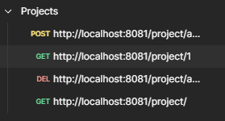
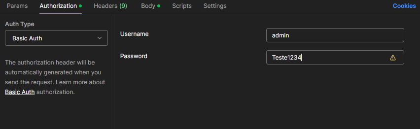
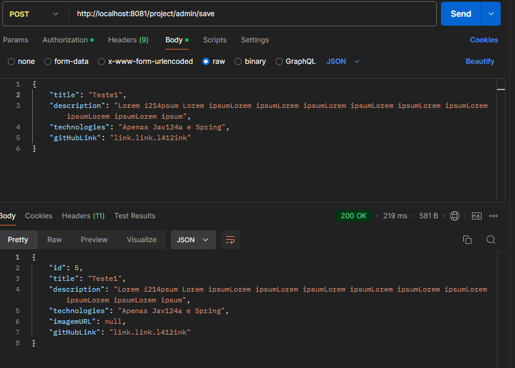

# Personal Projects - A project made with Java Spring Framework

### What is the purpose of the project?
This project aims to showcase my projects, with a brief explanation about the project and how to use it and technologies used.

This project was made using Java and Spring Framework.

  
  
  

## How it works?
 To perform CRUD on the database using the HTTP protocol with spring, I used `POSTMAN` for this. To perform CRUD, I created a new collection with the name `Projects` in `POSTMAN`, as shown in the image below.

Due to the security implemented, where only an admin user can perform the operations of creating, updating or deleting a project from the database, to make requests via `POSTMAN` I used the `Authorization` option where I entered the username and password so that the request was made correctly.

With authorization correctly configured, to carry out the method of creating a new project within the database, I used the `Body` option, where I selected the `raw` option and the `JSON` type, as follows:

Deleting and updating follows the same idea as the `POST` method, but only changes the route.

This project was created with the aim of showing my knowledge in `Java` together with the `Spring` Framework. Thanks for read!

